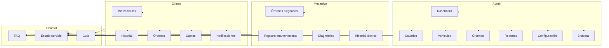

# AutoGest — Casos de Uso por Módulo

> Sistema web para gestión y seguimiento del mantenimiento vehicular.  
> Actores: **Administrador**, **Mecánico**, **Usuario/Cliente**, **Sistema**, **Chatbot**.

---

## Convenciones

| Campo | Descripción |
|-------|-------------|
| **ID** | Identificador único del caso de uso |
| **Actor principal** | Quien inicia la acción |
| **Prioridad** | Alta / Media / Baja |
| **Precondiciones** | Estado requerido antes de ejecutar |
| **Postcondiciones** | Estado del sistema tras finalizar con éxito |

---

## Módulo 1 — Administrador

### CU-ADM-01 · Iniciar sesión como administrador

| | |
|---|---|
| **Actor** | Administrador |
| **Prioridad** | Alta |
| **Precondiciones** | Cuenta activa con rol `admin` |
| **Flujo principal** | 1. Accede a `/login`. 2. Ingresa email y contraseña. 3. El sistema valida credenciales. 4. Redirige al dashboard administrativo. |
| **Flujos alternos** | 3a. Credenciales inválidas → mensaje de error. 3b. Cuenta inactiva → acceso denegado. |
| **Postcondiciones** | Sesión activa; registro en bitácora (`login`). |

---

### CU-ADM-02 · Consultar dashboard ejecutivo

| | |
|---|---|
| **Actor** | Administrador |
| **Prioridad** | Alta |
| **Precondiciones** | Sesión autenticada con rol admin |
| **Flujo principal** | 1. Accede al dashboard. 2. El sistema muestra KPIs (vehículos, mantenimientos, pendientes, gastos). 3. Muestra alertas críticas, gráfico mensual, actividad reciente y próximos mantenimientos. |
| **Postcondiciones** | Datos calculados en tiempo real desde la base de datos. |

---

### CU-ADM-03 · Gestionar usuarios (CRUD)

| | |
|---|---|
| **Actor** | Administrador |
| **Prioridad** | Alta |
| **Precondiciones** | Sesión admin |
| **Flujo principal** | 1. Navega a Usuarios. 2. Lista usuarios con filtros. 3. Crea/edita/elimina usuario. 4. Asigna rol (`admin`, `mecanico`, `cliente`) y estado (`activo`/`inactivo`). |
| **Flujos alternos** | 4a. Email duplicado → error de validación. 4b. Eliminar usuario con órdenes activas → confirmación o bloqueo. |
| **Postcondiciones** | Usuario persistido; bitácora registra la acción. |

---

### CU-ADM-04 · Registrar vehículo

| | |
|---|---|
| **Actor** | Administrador |
| **Prioridad** | Alta |
| **Precondiciones** | Cliente propietario registrado |
| **Flujo principal** | 1. Clic en "Nuevo Vehículo". 2. Completa placa, marca, modelo, año, kilometraje, fechas de seguro/revisión. 3. Asocia al cliente. 4. Guarda registro. |
| **Flujos alternos** | 3a. Placa duplicada → error. |
| **Postcondiciones** | Vehículo en BD; posible alerta si documentos próximos a vencer. |

---

### CU-ADM-05 · Editar o dar de baja vehículo

| | |
|---|---|
| **Actor** | Administrador |
| **Prioridad** | Media |
| **Precondiciones** | Vehículo existente |
| **Flujo principal** | 1. Selecciona vehículo. 2. Modifica datos o cambia estado a `inactivo`. 3. Guarda cambios. |
| **Postcondiciones** | Vehículo actualizado; bitácora registrada. |

---

### CU-ADM-06 · Crear orden de servicio

| | |
|---|---|
| **Actor** | Administrador |
| **Prioridad** | Alta |
| **Precondiciones** | Vehículo activo registrado |
| **Flujo principal** | 1. Clic en "Nuevo Mantenimiento/Orden". 2. Selecciona vehículo y describe el servicio. 3. Asigna mecánico (opcional). 4. Define prioridad y fecha programada. 5. Guarda orden con estado `recibida`. |
| **Postcondiciones** | Orden creada; notificación al mecánico asignado y al cliente. |

---

### CU-ADM-07 · Asignar o reasignar mecánico a orden

| | |
|---|---|
| **Actor** | Administrador |
| **Prioridad** | Alta |
| **Precondiciones** | Orden existente; mecánico activo |
| **Flujo principal** | 1. Abre orden de servicio. 2. Selecciona mecánico. 3. Confirma asignación. |
| **Postcondiciones** | `mechanic_id` actualizado; notificación al mecánico. |

---

### CU-ADM-08 · Supervisar mantenimientos

| | |
|---|---|
| **Actor** | Administrador |
| **Prioridad** | Alta |
| **Precondiciones** | Sesión admin |
| **Flujo principal** | 1. Accede a Mantenimientos. 2. Filtra por vehículo, tipo, estado y fechas. 3. Consulta detalle e historial. 4. Puede corregir datos o cancelar orden. |
| **Postcondiciones** | Vista actualizada según filtros. |

---

### CU-ADM-09 · Generar reportes

| | |
|---|---|
| **Actor** | Administrador |
| **Prioridad** | Alta |
| **Precondiciones** | Datos históricos en BD |
| **Flujo principal** | 1. Accede a Reportes. 2. Selecciona tipo (mantenimientos, gastos, vehículos, pendientes). 3. Aplica filtros (fechas, vehículo). 4. Genera vista/PDF/Excel. |
| **Postcondiciones** | Reporte generado; opcional registro en bitácora. |

---

### CU-ADM-10 · Gestionar calendario de mantenimientos

| | |
|---|---|
| **Actor** | Administrador |
| **Prioridad** | Media |
| **Precondiciones** | Sesión admin |
| **Flujo principal** | 1. Accede al Calendario. 2. Visualiza eventos por mes. 3. Crea/edita/elimina evento programado. |
| **Postcondiciones** | Evento persistido; alertas actualizadas. |

---

### CU-ADM-11 · Gestionar alertas del sistema

| | |
|---|---|
| **Actor** | Administrador |
| **Prioridad** | Alta |
| **Precondiciones** | Reglas de alerta configuradas |
| **Flujo principal** | 1. Consulta alertas (dashboard o módulo). 2. Revisa detalle (vehículo, vencimiento, severidad). 3. Marca como resuelta o genera orden de servicio. |
| **Postcondiciones** | Alerta actualizada; posible nueva orden. |

---

### CU-ADM-12 · Configurar sistema

| | |
|---|---|
| **Actor** | Administrador |
| **Prioridad** | Media |
| **Precondiciones** | Rol admin exclusivo |
| **Flujo principal** | 1. Accede a Configuración. 2. Modifica pestañas: General, Empresa, Notificaciones, Seguridad, Respaldos. 3. Guarda cambios. |
| **Postcondiciones** | Parámetros en `system_settings`; bitácora registrada. |

---

### CU-ADM-13 · Consultar bitácora de actividades

| | |
|---|---|
| **Actor** | Administrador |
| **Prioridad** | Media |
| **Precondiciones** | Sesión admin |
| **Flujo principal** | 1. Accede a Bitácora. 2. Filtra por usuario, acción y rango de fechas. 3. Consulta detalle (IP, descripción). 4. Exporta si requiere. |
| **Postcondiciones** | Auditoría consultada (solo lectura). |

---

### CU-ADM-14 · Cerrar sesión

| | |
|---|---|
| **Actor** | Administrador |
| **Prioridad** | Alta |
| **Precondiciones** | Sesión activa |
| **Flujo principal** | 1. Clic en "Cerrar sesión". 2. Sistema invalida sesión. 3. Redirige al login. |
| **Postcondiciones** | Sesión destruida; bitácora `logout`. |

---

## Módulo 2 — Mecánico

### CU-MEC-01 · Iniciar sesión como mecánico

| | |
|---|---|
| **Actor** | Mecánico |
| **Prioridad** | Alta |
| **Precondiciones** | Cuenta activa con rol `mecanico` |
| **Flujo principal** | Igual a CU-ADM-01, redirigiendo al panel del mecánico. |
| **Postcondiciones** | Sesión activa; acceso restringido a funciones del módulo mecánico. |

---

### CU-MEC-02 · Consultar órdenes asignadas

| | |
|---|---|
| **Actor** | Mecánico |
| **Prioridad** | Alta |
| **Precondiciones** | Sesión mecánico; órdenes asignadas |
| **Flujo principal** | 1. Accede a "Mis órdenes". 2. Lista órdenes con estado, vehículo y prioridad. 3. Filtra por pendientes/en proceso. |
| **Postcondiciones** | Solo ve órdenes donde `mechanic_id` = su ID. |

---

### CU-MEC-03 · Actualizar estado de orden

| | |
|---|---|
| **Actor** | Mecánico |
| **Prioridad** | Alta |
| **Precondiciones** | Orden asignada al mecánico |
| **Flujo principal** | 1. Abre orden. 2. Cambia estado: `en_proceso` → `completada`. 3. Guarda. |
| **Flujos alternos** | 2a. Reporta impedimento → agrega observación; notifica admin. |
| **Postcondiciones** | Estado actualizado; notificación al cliente y admin. |

---

### CU-MEC-04 · Registrar mantenimiento realizado

| | |
|---|---|
| **Actor** | Mecánico |
| **Prioridad** | Alta |
| **Precondiciones** | Orden en estado `en_proceso` |
| **Flujo principal** | 1. Abre formulario de mantenimiento. 2. Registra tipo, descripción, kilometraje, repuestos, costo. 3. Adjunta observaciones técnicas. 4. Guarda. |
| **Postcondiciones** | Registro en `maintenances`; costo sumado a la orden. |

---

### CU-MEC-05 · Registrar diagnóstico y recomendaciones

| | |
|---|---|
| **Actor** | Mecánico |
| **Prioridad** | Alta |
| **Precondiciones** | Orden asignada |
| **Flujo principal** | 1. Edita campos `diagnosis` y `recommendations` de la orden. 2. Guarda. |
| **Postcondiciones** | Cliente puede consultar diagnóstico en su portal. |

---

### CU-MEC-06 · Consultar información del vehículo

| | |
|---|---|
| **Actor** | Mecánico |
| **Prioridad** | Media |
| **Precondiciones** | Vehículo vinculado a orden asignada |
| **Flujo principal** | 1. Desde la orden, accede a ficha del vehículo. 2. Consulta datos técnicos e historial de intervenciones. |
| **Postcondiciones** | Solo lectura; sin modificar datos del vehículo. |

---

### CU-MEC-07 · Consultar historial de intervenciones

| | |
|---|---|
| **Actor** | Mecánico |
| **Prioridad** | Media |
| **Precondiciones** | Sesión mecánico |
| **Flujo principal** | 1. Busca vehículo por placa. 2. Visualiza mantenimientos previos (propios y de otros mecánicos). |
| **Postcondiciones** | Historial técnico consultado. |

---

### CU-MEC-08 · Informar avance de trabajo

| | |
|---|---|
| **Actor** | Mecánico |
| **Prioridad** | Media |
| **Precondiciones** | Orden en proceso |
| **Flujo principal** | 1. Agrega comentario de avance en la orden. 2. Sistema notifica al cliente. |
| **Postcondiciones** | Comentario persistido; notificación enviada. |

---

### CU-MEC-09 · Consultar calendario de trabajos

| | |
|---|---|
| **Actor** | Mecánico |
| **Prioridad** | Baja |
| **Precondiciones** | Eventos programados asignados |
| **Flujo principal** | 1. Accede al calendario (solo lectura). 2. Visualiza citas del mes. |
| **Postcondiciones** | Vista filtrada por mecánico. |

---

## Módulo 3 — Usuario / Cliente

### CU-CLI-01 · Iniciar sesión como cliente

| | |
|---|---|
| **Actor** | Cliente |
| **Prioridad** | Alta |
| **Precondiciones** | Cuenta activa con rol `cliente` |
| **Flujo principal** | Igual a CU-ADM-01, redirigiendo al portal del cliente. |
| **Postcondiciones** | Sesión activa con aislamiento de datos propios. |

---

### CU-CLI-02 · Consultar estado de mis vehículos

| | |
|---|---|
| **Actor** | Cliente |
| **Prioridad** | Alta |
| **Precondiciones** | Vehículos vinculados al cliente |
| **Flujo principal** | 1. Accede a "Mis vehículos". 2. Visualiza lista con estado, kilometraje y próximo servicio. |
| **Postcondiciones** | Solo vehículos donde `client_id` = su ID. |

---

### CU-CLI-03 · Consultar historial de mantenimientos

| | |
|---|---|
| **Actor** | Cliente |
| **Prioridad** | Alta |
| **Precondiciones** | Mantenimientos registrados en sus vehículos |
| **Flujo principal** | 1. Selecciona vehículo. 2. Visualiza historial (fecha, tipo, costo, estado). |
| **Postcondiciones** | Datos filtrados por propiedad del vehículo. |

---

### CU-CLI-04 · Visualizar próximos mantenimientos

| | |
|---|---|
| **Actor** | Cliente |
| **Prioridad** | Alta |
| **Precondiciones** | Eventos programados o alertas activas |
| **Flujo principal** | 1. Accede a "Próximos mantenimientos". 2. Consulta fechas, tipo y estado (`próximo` / `en fecha`). |
| **Postcondiciones** | Información actualizada desde `maintenance_schedules` y alertas. |

---

### CU-CLI-05 · Recibir notificaciones y alertas

| | |
|---|---|
| **Actor** | Cliente, Sistema |
| **Prioridad** | Alta |
| **Precondiciones** | Evento disparador (cambio de estado, vencimiento) |
| **Flujo principal** | 1. Sistema detecta evento. 2. Crea notificación. 3. Cliente la visualiza en campana/panel. 4. Marca como leída. |
| **Postcondiciones** | Cliente informado sin llamar al taller. |

---

### CU-CLI-06 · Consultar órdenes de servicio

| | |
|---|---|
| **Actor** | Cliente |
| **Prioridad** | Alta |
| **Precondiciones** | Órdenes de sus vehículos |
| **Flujo principal** | 1. Accede a "Mis órdenes". 2. Consulta estado, diagnóstico y avances. |
| **Postcondiciones** | Solo órdenes de vehículos propios. |

---

### CU-CLI-07 · Consultar gastos de mantenimiento

| | |
|---|---|
| **Actor** | Cliente |
| **Prioridad** | Media |
| **Precondiciones** | Mantenimientos con costo registrado |
| **Flujo principal** | 1. Accede a "Gastos". 2. Visualiza desglose por vehículo y total mensual. 3. Exporta PDF propio. |
| **Postcondiciones** | Totales calculados desde `maintenances.cost`. |

---

### CU-CLI-08 · Actualizar perfil personal

| | |
|---|---|
| **Actor** | Cliente |
| **Prioridad** | Media |
| **Precondiciones** | Sesión activa |
| **Flujo principal** | 1. Accede a Perfil. 2. Modifica nombre, teléfono, contraseña. 3. Guarda. |
| **Flujos alternos** | 3a. Contraseña actual incorrecta → error. |
| **Postcondiciones** | Datos de perfil actualizados. |

---

## Módulo 4 — Chatbot inteligente

### CU-BOT-01 · Consultar FAQ

| | |
|---|---|
| **Actor** | Cualquier usuario autenticado |
| **Prioridad** | Media |
| **Precondiciones** | Sesión activa |
| **Flujo principal** | 1. Abre chatbot. 2. Escribe pregunta frecuente. 3. Bot responde desde `chatbot_faqs`. |
| **Postcondiciones** | Respuesta mostrada; mensaje guardado en historial. |

---

### CU-BOT-02 · Consultar estado de mantenimiento vía chat

| | |
|---|---|
| **Actor** | Cliente (principal), Mecánico, Admin |
| **Prioridad** | Alta |
| **Precondiciones** | Datos de órdenes/mantenimientos en BD |
| **Flujo principal** | 1. Cliente pregunta: "¿Estado del vehículo ABC-123?". 2. Bot valida permisos y consulta BD. 3. Responde con estado actual. |
| **Flujos alternos** | 2a. Vehículo no pertenece al cliente → respuesta de acceso denegado. 2b. Sin datos → sugerir contactar al taller. |
| **Postcondiciones** | Consulta registrada en `chatbot_messages`. |

---

### CU-BOT-03 · Guiar navegación del sistema

| | |
|---|---|
| **Actor** | Cualquier usuario autenticado |
| **Prioridad** | Baja |
| **Precondiciones** | Sesión activa |
| **Flujo principal** | 1. Usuario pregunta cómo realizar una acción. 2. Bot responde con pasos según rol. |
| **Postcondiciones** | Usuario orientado dentro del sistema. |

---

### CU-BOT-04 · Administrar respuestas FAQ (solo admin)

| | |
|---|---|
| **Actor** | Administrador |
| **Prioridad** | Baja |
| **Precondiciones** | Rol admin |
| **Flujo principal** | 1. Accede a configuración del chatbot. 2. Crea/edita/desactiva preguntas y respuestas. |
| **Postcondiciones** | FAQ actualizada. |

---

## Casos de uso transversales (Sistema)

### CU-SIS-01 · Generar alertas automáticas

| | |
|---|---|
| **Actor** | Sistema |
| **Prioridad** | Alta |
| **Precondiciones** | Cron/job programado o evento de guardado |
| **Flujo principal** | 1. Evalúa fechas de seguro, revisión técnica y mantenimientos programados. 2. Crea alertas con severidad. 3. Notifica a admin y cliente. |
| **Postcondiciones** | Alertas en BD; notificaciones enviadas. |

---

### CU-SIS-02 · Registrar actividad en bitácora

| | |
|---|---|
| **Actor** | Sistema |
| **Prioridad** | Alta |
| **Precondiciones** | Acción crítica ejecutada (login, CRUD, cambio de estado) |
| **Flujo principal** | 1. Intercepta evento. 2. Persiste usuario, acción, IP, descripción. |
| **Postcondiciones** | Registro en `activity_logs`. |

---

## Matriz Actor ↔ Caso de Uso

| Caso de uso | Admin | Mecánico | Cliente |
|-------------|:-----:|:--------:|:-------:|
| CU-ADM-01 a CU-ADM-14 | ✓ | — | — |
| CU-MEC-01 a CU-MEC-09 | — | ✓ | — |
| CU-CLI-01 a CU-CLI-08 | — | — | ✓ |
| CU-BOT-01, CU-BOT-03 | ✓ | ✓ | ✓ |
| CU-BOT-02 | ✓ | ✓ | ✓* |
| CU-BOT-04 | ✓ | — | — |
| CU-SIS-01, CU-SIS-02 | (automático) | (automático) | (automático) |

\* Cliente solo consulta datos propios vía CU-BOT-02.

---

## Diagrama de casos de uso (resumen)

