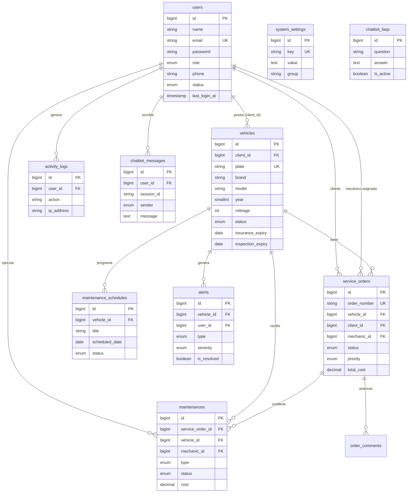

# AutoGest — Esquema de Base de Datos MySQL

> Diseño relacional para Laravel + MySQL 8.x.  
> Migraciones en `database/migrations/2026_05_29_*`.

---

## Diagrama entidad-relación



---

## Tablas y campos

### `users` (extendida)

| Columna | Tipo | Restricciones | Descripción |
|---------|------|---------------|-------------|
| id | BIGINT UNSIGNED | PK, AI | Identificador |
| name | VARCHAR(255) | NOT NULL | Nombre completo |
| email | VARCHAR(255) | UNIQUE, NOT NULL | Correo de acceso |
| email_verified_at | TIMESTAMP | NULL | Verificación email |
| password | VARCHAR(255) | NOT NULL | Hash bcrypt |
| role | ENUM | NOT NULL, DEFAULT `cliente` | `admin`, `mecanico`, `cliente` |
| phone | VARCHAR(20) | NULL | Teléfono |
| status | ENUM | NOT NULL, DEFAULT `activo` | `activo`, `inactivo` |
| last_login_at | TIMESTAMP | NULL | Último acceso |
| remember_token | VARCHAR(100) | NULL | Token sesión persistente |
| created_at / updated_at | TIMESTAMP | | Auditoría Laravel |

**Índices:** `email`, `role`, `status`

---

### `vehicles`

| Columna | Tipo | Restricciones | Descripción |
|---------|------|---------------|-------------|
| id | BIGINT UNSIGNED | PK, AI | |
| client_id | BIGINT UNSIGNED | FK → users.id | Propietario |
| plate | VARCHAR(20) | UNIQUE, NOT NULL | Placa |
| brand | VARCHAR(100) | NOT NULL | Marca |
| model | VARCHAR(100) | NOT NULL | Modelo |
| year | SMALLINT UNSIGNED | NULL | Año |
| color | VARCHAR(50) | NULL | Color |
| mileage | INT UNSIGNED | DEFAULT 0 | Kilometraje actual |
| vin | VARCHAR(50) | NULL | Número de serie |
| photo | VARCHAR(255) | NULL | Ruta imagen |
| status | ENUM | DEFAULT `activo` | `activo`, `inactivo`, `en_taller` |
| insurance_expiry | DATE | NULL | Vencimiento seguro |
| inspection_expiry | DATE | NULL | Vencimiento revisión técnica |
| notes | TEXT | NULL | Observaciones |
| created_at / updated_at | TIMESTAMP | | |

**Índices:** `client_id`, `plate`, `status`

---

### `service_orders` (órdenes de servicio)

| Columna | Tipo | Restricciones | Descripción |
|---------|------|---------------|-------------|
| id | BIGINT UNSIGNED | PK, AI | |
| order_number | VARCHAR(30) | UNIQUE, NOT NULL | Ej: OS-2026-0001 |
| vehicle_id | BIGINT UNSIGNED | FK → vehicles.id | Vehículo |
| client_id | BIGINT UNSIGNED | FK → users.id | Cliente |
| mechanic_id | BIGINT UNSIGNED | FK → users.id, NULL | Mecánico asignado |
| created_by | BIGINT UNSIGNED | FK → users.id | Quien creó la orden |
| status | ENUM | DEFAULT `recibida` | Ver estados abajo |
| priority | ENUM | DEFAULT `normal` | `baja`, `normal`, `alta`, `urgente` |
| description | TEXT | NULL | Descripción del servicio |
| diagnosis | TEXT | NULL | Diagnóstico técnico |
| recommendations | TEXT | NULL | Recomendaciones |
| scheduled_at | DATETIME | NULL | Fecha programada |
| started_at | DATETIME | NULL | Inicio de trabajo |
| completed_at | DATETIME | NULL | Finalización |
| estimated_cost | DECIMAL(10,2) | NULL | Costo estimado |
| total_cost | DECIMAL(10,2) | DEFAULT 0 | Costo final |
| created_at / updated_at | TIMESTAMP | | |

**Estados:** `recibida`, `en_proceso`, `completada`, `entregada`, `cancelada`

**Índices:** `vehicle_id`, `client_id`, `mechanic_id`, `status`, `scheduled_at`

---

### `maintenances`

| Columna | Tipo | Restricciones | Descripción |
|---------|------|---------------|-------------|
| id | BIGINT UNSIGNED | PK, AI | |
| service_order_id | BIGINT UNSIGNED | FK, NULL | Orden padre (opcional) |
| vehicle_id | BIGINT UNSIGNED | FK → vehicles.id | |
| mechanic_id | BIGINT UNSIGNED | FK → users.id | |
| type | ENUM | NOT NULL | `preventivo`, `correctivo` |
| description | VARCHAR(255) | NOT NULL | Ej: Cambio de aceite |
| mileage_at_service | INT UNSIGNED | NULL | Km al servicio |
| parts_used | TEXT | NULL | Repuestos utilizados |
| technical_notes | TEXT | NULL | Notas técnicas |
| cost | DECIMAL(10,2) | DEFAULT 0 | Costo del servicio |
| status | ENUM | DEFAULT `pendiente` | `pendiente`, `en_proceso`, `completado`, `cancelado` |
| performed_at | DATETIME | NULL | Fecha de ejecución |
| created_at / updated_at | TIMESTAMP | | |

---

### `maintenance_schedules` (calendario / próximos)

| Columna | Tipo | Restricciones | Descripción |
|---------|------|---------------|-------------|
| id | BIGINT UNSIGNED | PK, AI | |
| vehicle_id | BIGINT UNSIGNED | FK | |
| title | VARCHAR(255) | NOT NULL | Ej: Cambio de aceite |
| maintenance_type | VARCHAR(100) | NULL | Tipo programado |
| scheduled_date | DATE | NOT NULL | Fecha prevista |
| mileage_target | INT UNSIGNED | NULL | Km objetivo |
| assigned_mechanic_id | BIGINT UNSIGNED | FK → users.id, NULL | |
| status | ENUM | DEFAULT `programado` | `programado`, `completado`, `vencido`, `cancelado` |
| notes | TEXT | NULL | |
| created_at / updated_at | TIMESTAMP | | |

---

### `order_comments` (avances de trabajo)

| Columna | Tipo | Restricciones | Descripción |
|---------|------|---------------|-------------|
| id | BIGINT UNSIGNED | PK, AI | |
| service_order_id | BIGINT UNSIGNED | FK | |
| user_id | BIGINT UNSIGNED | FK → users.id | Autor |
| comment | TEXT | NOT NULL | Avance u observación |
| created_at / updated_at | TIMESTAMP | | |

---

### `alerts`

| Columna | Tipo | Restricciones | Descripción |
|---------|------|---------------|-------------|
| id | BIGINT UNSIGNED | PK, AI | |
| vehicle_id | BIGINT UNSIGNED | FK, NULL | |
| user_id | BIGINT UNSIGNED | FK → users.id | Destinatario |
| type | ENUM | NOT NULL | `maintenance_due`, `insurance_expiry`, `inspection_expiry`, `custom` |
| title | VARCHAR(255) | NOT NULL | |
| message | TEXT | NOT NULL | |
| severity | ENUM | DEFAULT `info` | `info`, `warning`, `critical` |
| due_date | DATE | NULL | |
| is_read | BOOLEAN | DEFAULT false | |
| is_resolved | BOOLEAN | DEFAULT false | |
| resolved_at | TIMESTAMP | NULL | |
| created_at / updated_at | TIMESTAMP | | |

---

### `notifications` (Laravel estándar)

| Columna | Tipo | Descripción |
|---------|------|-------------|
| id | UUID | PK |
| type | VARCHAR(255) | Clase de notificación |
| notifiable_type / notifiable_id | MORPHS | Usuario destino |
| data | JSON | Payload |
| read_at | TIMESTAMP | NULL |
| created_at / updated_at | TIMESTAMP | |

---

### `activity_logs` (bitácora)

| Columna | Tipo | Restricciones | Descripción |
|---------|------|---------------|-------------|
| id | BIGINT UNSIGNED | PK, AI | |
| user_id | BIGINT UNSIGNED | FK, NULL | Usuario (NULL si sistema) |
| action | VARCHAR(100) | NOT NULL | Ej: `login`, `vehicle.created` |
| model_type | VARCHAR(255) | NULL | Clase Eloquent |
| model_id | BIGINT UNSIGNED | NULL | ID del registro |
| description | TEXT | NULL | Detalle legible |
| ip_address | VARCHAR(45) | NULL | |
| user_agent | TEXT | NULL | |
| created_at / updated_at | TIMESTAMP | | |

**Índices:** `user_id`, `action`, `created_at`

---

### `system_settings`

| Columna | Tipo | Restricciones | Descripción |
|---------|------|---------------|-------------|
| id | BIGINT UNSIGNED | PK, AI | |
| key | VARCHAR(100) | UNIQUE | Ej: `app.name` |
| value | TEXT | NULL | Valor serializado |
| group | VARCHAR(50) | DEFAULT `general` | `general`, `empresa`, `notificaciones`, `seguridad` |
| created_at / updated_at | TIMESTAMP | | |

---

### `chatbot_faqs`

| Columna | Tipo | Restricciones | Descripción |
|---------|------|---------------|-------------|
| id | BIGINT UNSIGNED | PK, AI | |
| category | VARCHAR(100) | NULL | Agrupación |
| question | VARCHAR(500) | NOT NULL | Pregunta |
| answer | TEXT | NOT NULL | Respuesta |
| keywords | VARCHAR(500) | NULL | Palabras clave para matching |
| is_active | BOOLEAN | DEFAULT true | |
| sort_order | SMALLINT | DEFAULT 0 | |
| created_at / updated_at | TIMESTAMP | | |

---

### `chatbot_messages`

| Columna | Tipo | Restricciones | Descripción |
|---------|------|---------------|-------------|
| id | BIGINT UNSIGNED | PK, AI | |
| user_id | BIGINT UNSIGNED | FK | |
| session_id | VARCHAR(64) | NOT NULL | Agrupa conversación |
| sender | ENUM | NOT NULL | `user`, `bot` |
| message | TEXT | NOT NULL | |
| metadata | JSON | NULL | Contexto de consulta |
| created_at / updated_at | TIMESTAMP | | |

---

## Relaciones Eloquent (mapa Laravel)

```
User
├── hasMany Vehicle (client_id)
├── hasMany ServiceOrder (client_id | mechanic_id)
├── hasMany Maintenance (mechanic_id)
├── hasMany ActivityLog
└── hasMany ChatbotMessage

Vehicle
├── belongsTo User (client)
├── hasMany ServiceOrder
├── hasMany Maintenance
├── hasMany MaintenanceSchedule
└── hasMany Alert

ServiceOrder
├── belongsTo Vehicle, User (client, mechanic, creator)
├── hasMany Maintenance
└── hasMany OrderComment

Maintenance
├── belongsTo ServiceOrder, Vehicle, User (mechanic)
```

---

## Reglas de integridad y negocio

1. **Placa única** en `vehicles.plate`.
2. **Orden única** por `order_number` (generado: `OS-{AÑO}-{SECUENCIA}`).
3. **Soft delete opcional** en vehículos y usuarios (fase 2); inicialmente usar `status = inactivo`.
4. **Aislamiento cliente:** toda consulta del rol `cliente` filtra por `client_id = auth()->id()`.
5. **Mecánico:** solo UPDATE en órdenes donde `mechanic_id = auth()->id()`.
6. **Costo total orden:** `total_cost` = SUM(`maintenances.cost`) vía observer o evento.
7. **Alertas automáticas:** job diario evalúa `insurance_expiry`, `inspection_expiry`, `maintenance_schedules`.

---

## Configuración MySQL (.env)

```env
DB_CONNECTION=mysql
DB_HOST=127.0.0.1
DB_PORT=3306
DB_DATABASE=autogest
DB_USERNAME=root
DB_PASSWORD=
```

---

## Orden de migraciones

| # | Archivo | Tabla |
|---|---------|-------|
| 1 | `2026_05_29_000001_extend_users_table` | Alter users |
| 2 | `2026_05_29_000002_create_vehicles_table` | vehicles |
| 3 | `2026_05_29_000003_create_service_orders_table` | service_orders |
| 4 | `2026_05_29_000004_create_maintenances_table` | maintenances |
| 5 | `2026_05_29_000005_create_maintenance_schedules_table` | maintenance_schedules |
| 6 | `2026_05_29_000006_create_order_comments_table` | order_comments |
| 7 | `2026_05_29_000007_create_alerts_table` | alerts |
| 8 | `2026_05_29_000008_create_notifications_table` | notifications |
| 9 | `2026_05_29_000009_create_activity_logs_table` | activity_logs |
| 10 | `2026_05_29_000010_create_system_settings_table` | system_settings |
| 11 | `2026_05_29_000011_create_chatbot_faqs_table` | chatbot_faqs |
| 12 | `2026_05_29_000012_create_chatbot_messages_table` | chatbot_messages |

Ejecutar:

```bash
php artisan migrate
php artisan db:seed
```
